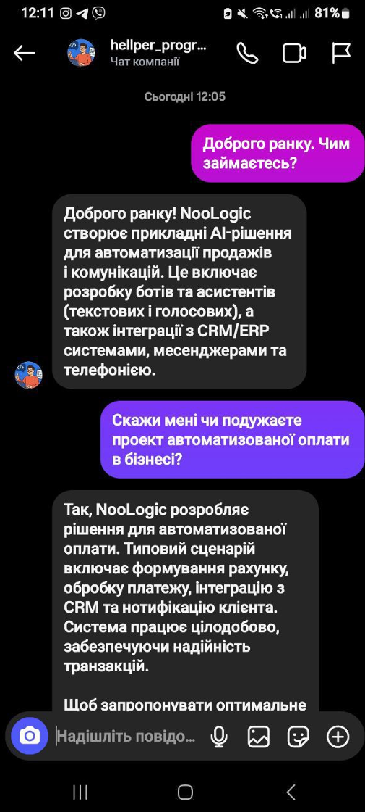
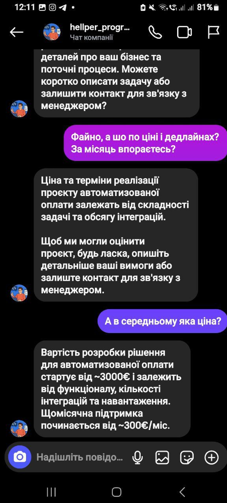
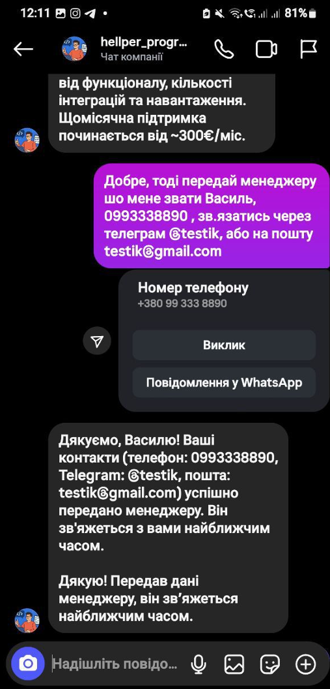
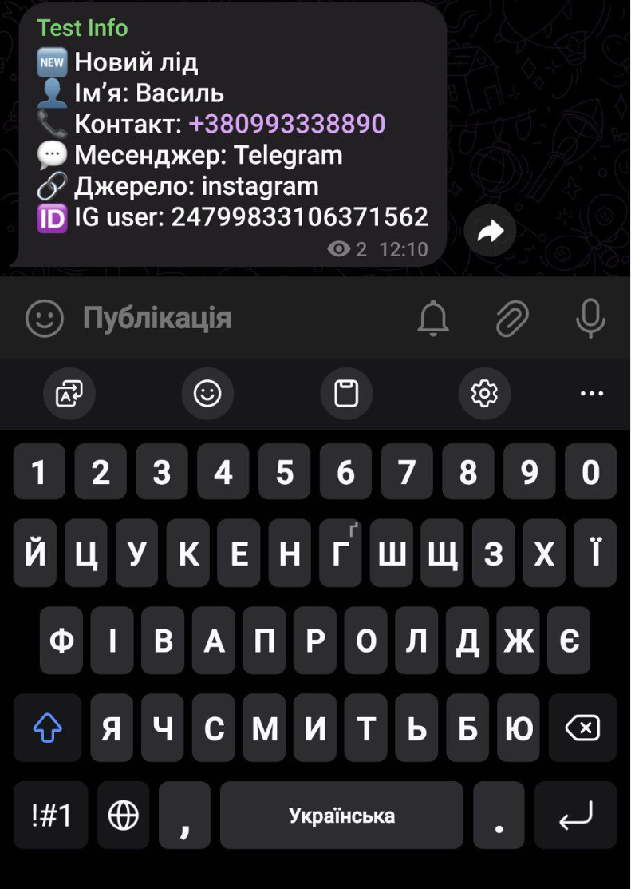
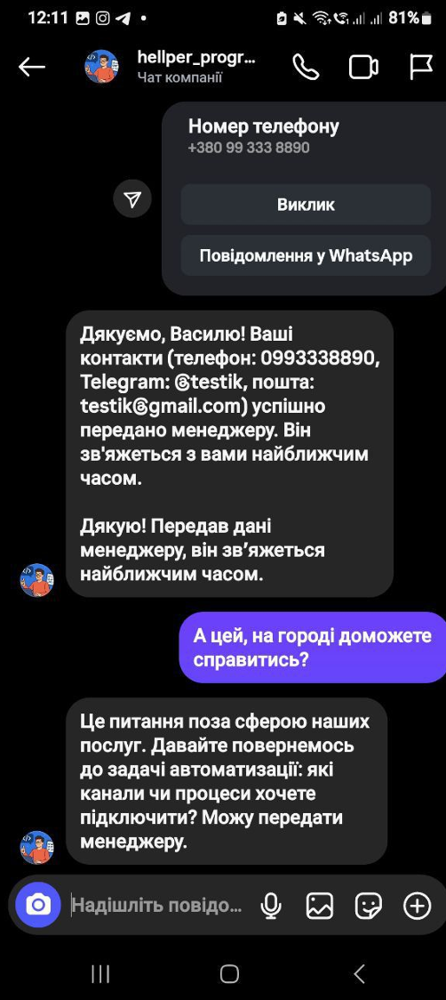

# NooLogic AI Sales Agent

An intelligent AI Sales Assistant designed for Instagram and Telegram automation. This bot acts as a first-line support and sales representative: it consults potential clients, calculates preliminary costs, filters off-topic queries, and automatically captures leads into a CRM/Telegram admin channel.

It utilizes **RAG (Retrieval-Augmented Generation)** to answer business-specific questions strictly based on your company's knowledge base.

## Key Features

* **Smart Consultation:** Understands context and answers questions about services, tech stack, and company expertise using LLM.
* **Lead Generation:** Detects purchase intent and collects user contact details (Name, Phone, Email/Telegram).
* **CRM Integration:** Instantly sends structured lead reports to an Admin Telegram channel.
* **Topic Guardrails:** Politeness filters that steer the conversation back to business if the user asks irrelevant questions (e.g., gardening, weather).
* **Price Estimation:** Provides rough estimates based on user requirements found in the knowledge base.

## Project Structure

* `AI Agent.py`: Core logic for the AI assistant, managing conversation history and prompt chains.
* `BotTG.py`: Telegram Bot listener that handles incoming messages and routes them to the AI.
* `ingest_knowledge.py`: Script to index your company's documentation (PDF/TXT) from `knowledge_public/` into a vector database.
* `NooLogic_CRM.py`: Handles lead processing and formatting notifications for the admin.
* `system_noologic_prompt.py`: System instructions defining the AI's persona, tone of voice, and sales scripts.

## Demo Workflow

The following screenshots demonstrate the bot's logic flow, from initial contact to lead capture.

### 1. Intro & Consultation
The bot greets the user and explains the company's focus.
<br>


### 2. Pricing Estimation
The bot provides pricing ranges based on the knowledge base.
<br>


### 3. Lead Capture
When the user is ready, the bot collects contact information naturally.
<br>


### 4. CRM Notification (Admin View)
The moment a user leaves data, the admin receives a structured "New Lead" alert.
<br>


### 5. Guardrails (Off-topic Filter)
The bot politely refuses to answer irrelevant questions and returns to business topics.
<br>


## Installation

1.  **Clone the repository**
    ```bash
    git clone [https://github.com/GrabovetskiyOlkesandr/InstAIBotHelper.git](https://github.com/GrabovetskiyOlkesandr/InstAIBotHelper.git)
    cd InstAIBotHelper
    ```

2.  **Set up the environment**
    ```bash
    python -m venv .venv
    # Windows:
    .venv\Scripts\activate
    # macOS/Linux:
    source .venv/bin/activate
    ```

3.  **Install dependencies**
    ```bash
    pip install -r requirements.txt
    ```

4.  **Configuration**
    Create a `.env` file and populate it with your keys:
    * `BOT_TOKEN`: Your Telegram Bot API token.
    * `OPENAI_API_KEY`: Your OpenAI API key.
    * `ADMIN_CHANNEL_ID`: The ID of the channel where leads will be sent.

## Usage

**Step 1: Ingest Knowledge**
Load your company documents (prices, services) from the `knowledge_public` folder into the AI memory:
```bash
python ingest_knowledge.py
````
**Step 2: Start the Agent**
Launch the bot to handle incoming inquiries:
```bash
python BotTG.py
